# Yggdrasil

> The world tree, whose branches and roots bind all nine realms together.

  

*Image credit: [@norsemythologyclips](https://www.instagram.com/norsemythologyclips/) — go follow them.*

Connective tissue for the Norse Architecture — **`Norse.Hosting`**: the web, worker, and migration service chassis and the deployables built on it. Yggdrasil hosts the runtime endpoints that Bifröst composes but never provides itself — every service, component, and contract it serves is declared in some other realm and lands here by reference. In the dependency chain it rides on Midgard and everything below; nothing rides on Yggdrasil, because a proving ground is the top of the tree.

## The dependency graph

Arrows point at the thing depended on. Every edge is a declared reference in the owning `.csproj`; transitive dependencies are deliberately not redrawn (transitive-first is house law), with two recorded exceptions — `Hosting.Web.Client`'s direct `Infrastructure.Web.Grpc` edge exists so the NORSE080 analyzer survives NuGet's transitive strip in package mode, and the `Generator="true"` marks on `Infrastructure.Web.Server`/`.Web.Client` attach Midgard's wiring generators to those compilations. Non-Norse packages (FluentUI, BlazingStory, protobuf-net, Scalar) are off the chart by convention.

```mermaid
flowchart BT
	subgraph Yggdrasil["Yggdrasil — Norse.Hosting"]
		WebServer["Hosting.Web.Server"]
		WebClient["Hosting.Web.Client"]
		WebComponents["Hosting.Web.Components"]
		Worker["Hosting.Worker"]
		MigrationsService["Hosting.Migrations.Service"]
		StoriesHost["Hosting.Stories"]
	end
	subgraph Asgard["Asgard — Norse.Abstractions"]
		AContracts["Abstractions.Contracts"]
		AWebServer["Abstractions.Web.Server"]
		AComponents["Abstractions.Components"]
	end
	subgraph Midgard["Midgard — Norse.Infrastructure"]
		MWebServer["Infrastructure.Web.Server"]
		MWebClient["Infrastructure.Web.Client"]
		MWebGrpc["Infrastructure.Web.Grpc"]
		Backend["Infrastructure.Backend"]
		PersistenceEF["Infrastructure.Persistence.EntityFramework"]
		Migrations["Infrastructure.Migrations"]
		ThemeFluentUI["Infrastructure.Components.Theme.FluentUI"]
		ServiceDefaults["Infrastructure.ServiceDefaults"]
		ServiceDefaultsAspNet["Infrastructure.ServiceDefaults.AspNet"]
	end
	subgraph Urdarbrunnr["Urðarbrunnr — Norse.Persistence"]
		UMigrations["Persistence.EntityFramework.Migrations"]
	end
	subgraph Himinbjorg["Himinbjörg — Norse.Identity"]
		IdentityWebServer["Identity.Web.Server"]
		IdentityMigrationsPg["Identity.Migrations.PostgreSQL"]
	end
	subgraph Heimdall["Heimdall — Norse.AuthN"]
		AuthNFluentUI["AuthN.Components.FluentUI"]
		AuthNServices["AuthN.Services"]
	end
	subgraph Mimisbrunnr["Mímisbrunnr — Norse.Reference.Data"]
		RefDataEF["Reference.Data.EntityFramework"]
		RefDataEFMigPg["Reference.Data.EntityFramework.Migrations.PostgreSQL"]
	end
	subgraph Mimir["Mímir — Norse.Reference"]
		RefContracts["Reference.Contracts"]
		RefComponentsFluentUI["Reference.Components.FluentUI"]
		RefWebServer["Reference.Web.Server"]
	end
	subgraph Bragi["Bragi — Norse.DesignSystem"]
		Stories["DesignSystem.Stories"]
	end
	subgraph Naglfar["Naglfar — Norse.DesignSystem"]
		Tokens["DesignSystem.Tokens"]
	end
	WebServer --> AContracts
	WebServer --> AWebServer
	WebServer --> AuthNFluentUI
	WebServer --> IdentityWebServer
	WebServer --> Backend
	WebServer --> ThemeFluentUI
	WebServer --> PersistenceEF
	WebServer --> ServiceDefaultsAspNet
	WebServer --> MWebServer
	WebServer --> RefDataEF
	WebServer --> RefWebServer
	WebServer --> WebClient
	WebClient --> AContracts
	WebClient --> AuthNFluentUI
	WebClient --> ThemeFluentUI
	WebClient --> MWebClient
	WebClient --> MWebGrpc
	WebClient --> RefContracts
	WebClient --> Tokens
	WebClient --> WebComponents
	WebComponents --> AComponents
	WebComponents --> RefComponentsFluentUI
	Worker --> ServiceDefaults
	MigrationsService --> IdentityMigrationsPg
	MigrationsService --> Backend
	MigrationsService --> Migrations
	MigrationsService --> ServiceDefaults
	MigrationsService --> UMigrations
	MigrationsService --> RefDataEFMigPg
	StoriesHost --> AuthNServices
	StoriesHost --> Stories
	StoriesHost --> ThemeFluentUI
	StoriesHost --> ServiceDefaultsAspNet
```

## What's hosted here

- **`Hosting.Web.Server`** — the platform's composition root: Blazor (server + WASM render modes), the hand-rolled mediator pipeline (`AddNorsePipeline()`), the code-first gRPC transport with its three-interceptor stack, Himinbjörg's identity persistence and Heimdall's authn surface, Mímir's reference service and its REST facade, and the content-negotiated trilingual wire — one contract answering protobuf on the gRPC routes and JSON/XML through MVC's formatters, described by one OpenAPI document with [Scalar](https://scalar.com) as its dev-time face. Negotiation is honest: JSON is the default channel, XML is opt-in by `Accept` header, and anything else is a 406, never a silent fallback.
- **`Hosting.Web.Client`** — the browser: a cookie-credentialed gRPC-Web channel to the generated client proxies (`AddNorseGrpcClients()`), `OutcomeClientInterceptor` decoding wire failures back into `Outcome<T>`, and FluentUI theming seeded from Naglfar's token package.
- **`Hosting.Web.Components`** — the shared page shell (layout, nav, template pages, circuit safety net). Realm components arrive by the drop-in law: referencing the assembly *is* the registration — Mímir's `CountryLookup` page routed and served with no host edit beyond its nav entry.
- **`Hosting.Migrations.Service`** — the permanent three-line migrations deployable: `AddNorseMigrations()` discovers every contributor at compile time, runs them against Postgres, and exits clean. New bounded contexts join by reference, never by edit.
- **`Hosting.Stories`** — the BlazingStory catalog host for Bragi's `DesignSystem.Stories`, now Blazor Interactive Server (not WASM) and also exposing an MCP endpoint (`AddBlazingStoryMcpServer()`/`MapBlazingStoryMcp()`), published to `ghcr.io/norsearchitecture/hosting/stories`.
- **`Hosting.Worker`** — the one genuine stub left, waiting on the hosting abstractions from Asgard and Midgard.

## Status

The tri-format wire is live end to end: the same country document answers over gRPC (the verbless `/grpc.reference.v1.ReferenceService/GetCountry` route) and over REST as content-negotiated JSON or XML (`GET /api/reference/countries/US`), the OpenAPI document declares exactly what the REST leg serves (with the standard idiomatic response codes stamped onto every operation; the gRPC leg's discovery surface is the reflection service, dev-only), and both discovery surfaces integrate with Postman/Bruno — Vafthrudnir's collections interrogate them, and the browser's `CountryLookup` proves the round trip by re-deriving the wire's v5 identifier from the client-baked dataset. Every deployable here follows the spec-first discipline: brainstorm → spec → plan in [Glitnir](https://github.com/NorseArchitecture/Glitnir)'s [docs/Yggdrasil/](https://github.com/NorseArchitecture/Glitnir/tree/master/docs/Yggdrasil), greenlit by the human, then code.

## The cosmos

Yggdrasil is one realm of the [Norse Architecture](https://github.com/NorseArchitecture). The whole platform composes at [Bifröst](https://github.com/NorseArchitecture/Bifrost) — clone once, cross the bridge, and every session starts there so decisions get brainstormed across the entire landscape, not in isolation. Every design is tried in [Glitnir](https://github.com/NorseArchitecture/Glitnir), the design court, before code is forged here.

## Soundtrack: Yggdrasil

